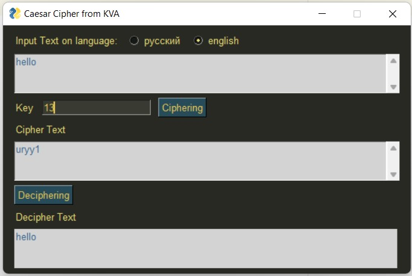
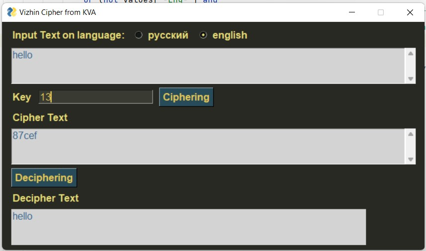
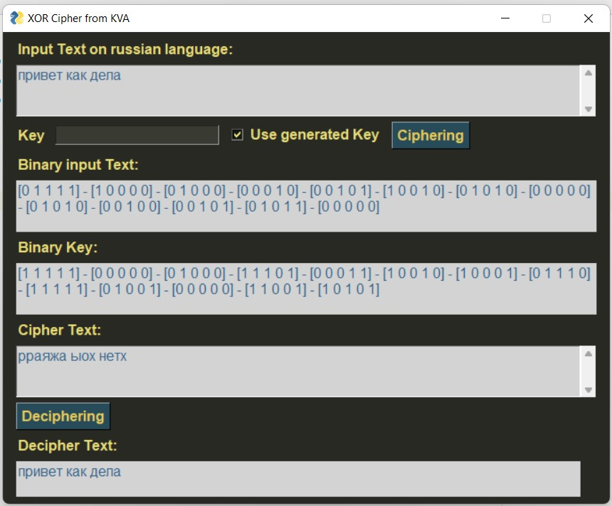
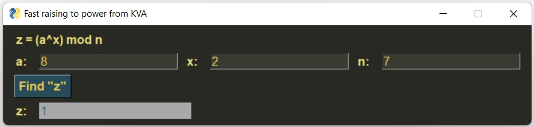
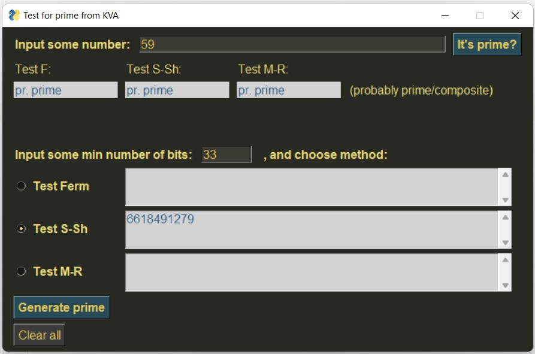
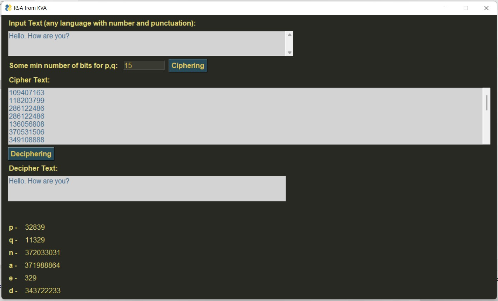
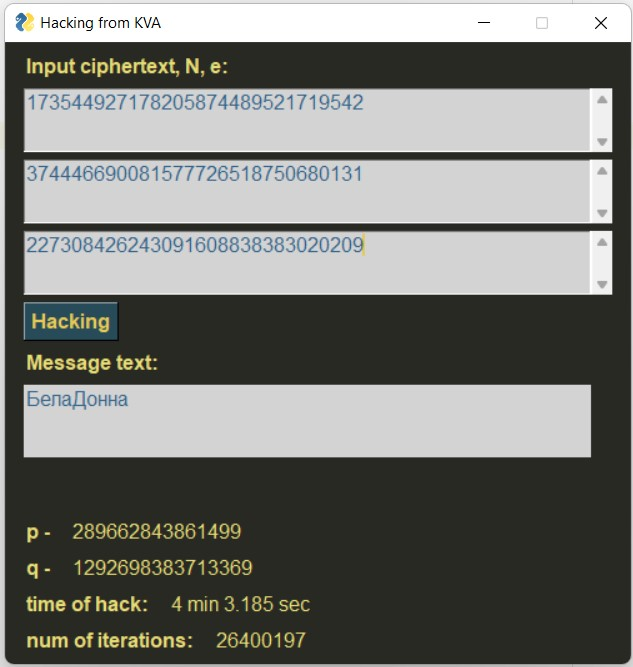

# info-security
4th course, labs, GUI

### How to run
Load all files and run needed of them (some programs use functions from each other)

## 1 lab

## 2 lab

## 3 lab

## 4 lab

## 5 lab

## 6 lab

## 7 lab

